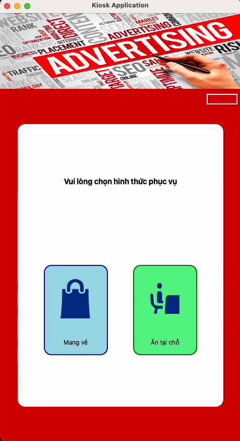
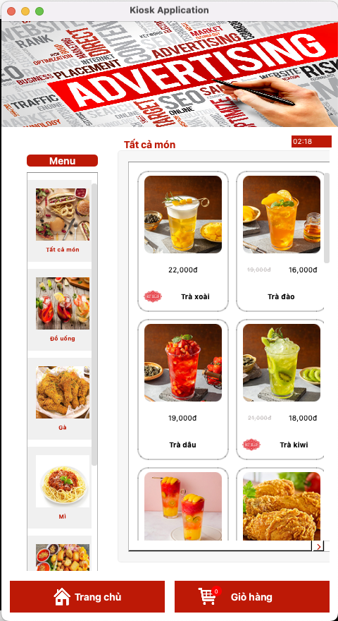
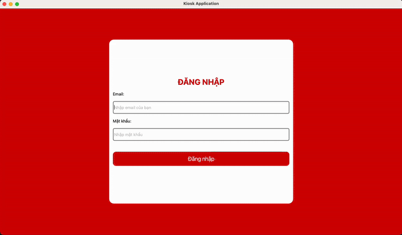
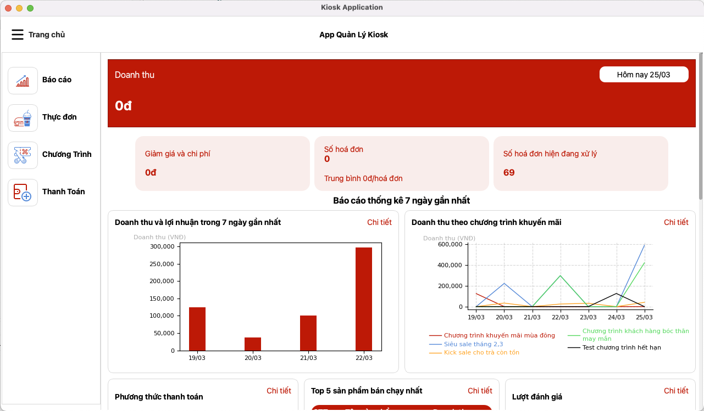

# comprehensive-kiosk-management-app

## 📌 Project Overview

**Selling Kiosk Apps** is a self-service ordering system designed for the **Food & Beverage (F&B) industry**. This project automates the ordering process, enhances customer experience, and optimizes business operations by reducing human intervention in the ordering workflow.

## 🔥 Features

### ✅ Kiosk App (Customer Interface)
- **Intuitive UI**: Easy-to-use touchscreen interface for customers.
- **Menu Browsing**: Displays food items with images and descriptions.
- **Cart Management**: Add, remove, or modify order items before checkout.
- **Multiple Payment Methods**: Supports both cash and online transactions.
- **Order Confirmation**: Generates order numbers for tracking.
- **Promo & Discounts**: Apply vouchers and discounts at checkout.

### ✅ Admin App (Management Interface)
- **Sales Dashboard**: Real-time analytics on revenue and order trends.
- **AI Recommendation**: Based on the current selling data to analyze and give recommendations that can enhance your business.
- **Menu Management**: Add, edit, delete menu items, categories, and combos.
- **Order Tracking**: Monitor order statuses in real-time.
- **Promotion & Voucher Management**: Set up and manage promotions easily.
- **User Management**: Assign roles and manage employee access.

## 🛠️ Tech Stack

### 📌 Frontend (Kiosk UI & Admin App)
- **Framework**: PyQt6
- **Libraries**: Matplotlib, dotenv, os, sys

### 📌 Backend
- **Language**: Python
- **Database**: MySQL (pymysql)
- **Architecture**: MVC (Model-View-Controller)

### 📌 Payment Integration
- **Platform**: PayOS
- **Libraries**: qrcode, payos

## 🎯 System Architecture

The system follows the **Model-View-Controller (MVC)** pattern:

1. **Model (M)**: Handles data, database queries, and business logic.
2. **View (V)**: Manages the graphical user interface for customers and admins.
3. **Controller (C)**: Processes user actions and updates the view accordingly.

```
📂 comprehensive-kiosk-management-app
 ├── 📂 controllers
 │   ├── DineSelectViewEx.py
 │   ├── FeedbackKhachhangEx.py
 │   └── ...
 ├── 📂 models
 │   ├── EnumClasses.py
 │   ├── FoodItem.py
 │   ├── Order.py
 │   └── ...
 ├── 📂 views
 │   ├── DineSelectView.py
 │   ├── FeedbackKhachhang.py
 │   └── ...
 ├── 📂 resources
 ├── .env
 ├── requirements.txt
 ├── README.md
 └── main.py
```

## 🚀 Installation & Setup

### Prerequisites
- Python 3.9+
- MySQL Database
- PyQt6 for UI Development

### Setup Guide
#### Init the project
```bash
# Clone the repository
git clone https://github.com/Poofy0103/comprehensive-kiosk-management-app.git
cd comprehensive-kiosk-management-app

# Install dependencies
pip install -r requirements.txt
```

#### Fill the environment file
```bash
CLIENT_ID="" #PAYOS info
API_KEY="" #PAYOS info
CHECKSUM_KEY="" #PAYOS info
HOST_DB="" #DB info
USER_DB="" #DB info
PASSWORD_DB="" #DB info
DB="" #DB info (database)
PORT_DB=3306 #DB info
GOOGLE_APPLICATION_CREDENTIALS="" #Path to GCP Service account credential file
GOOGLE_CLOUD_PROJECT=""
GOOGLE_CLOUD_LOCATION=""
GOOGLE_GENAI_USE_VERTEXAI="True"
```

#### Run apps
```bash
# Run the kiosk application
python -m kiosk_app.main

# Run the kiosk admin application
python -m admin_app.main
```

## 🎨 Screenshots

### 🔹 Kiosk App UI



### 🔹 Admin Dashboard



## 📜 License
This project is licensed under the MIT License.

## 📧 Contact
For questions or contributions, reach out to **Thien Diep (Noah)** at **thiendb0103@gmail.com**.
